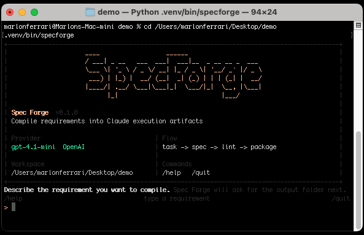
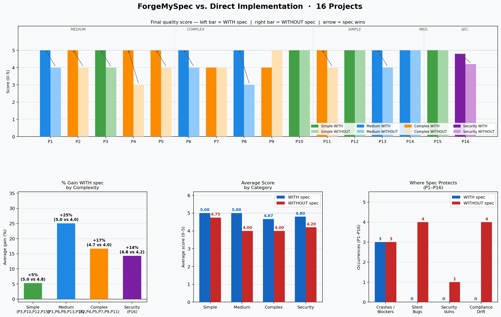
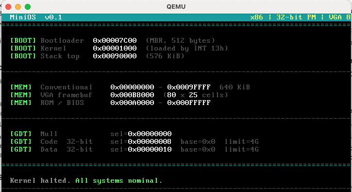

# ForgeMySpec



[](https://github.com/ferrarimarlon/forgemyspec/actions/workflows/tests.yml)

**Turn a human request into a machine-executable contract — before the first line of code is written.**

ForgeMySpec compiles natural-language requirements into a structured artifact bundle that gives a coding agent a stable, auditable contract to work from. The bundle is a **runtime-ready execution harness for Claude**: concrete files that drive implementation and verification alongside the agent.

## Why Use This?



Across 17 projects — task managers, REST APIs, cryptographic vaults, graph schedulers — both approaches got the algorithms right. The spec-first version was not more clever. It was more honest about what had been decided.

The failures in the without-framework version were not in the hard logic. They were in the places a competent implementer would not think to write down: whether a derived field should ever be persisted, in what order operations must run, what "done" means for a particular edge case. Those decisions still happened — they just happened inside the implementation, silently, with no record.

| | With spec | Without |
|---|:---:|:---:|
| Average completeness | 4.85 / 5 | 4.17 / 5 |
| Security vulnerabilities | 0 | 1 |
| Structural deviations | 0 | 7 |
| Silent quality issues | 4 | 9 |
| Projects with zero issues | 10 / 17 | 6 / 17 |

The threshold where a spec earns its cost is roughly three interacting business rules. Below that, both approaches converge and the overhead is real. Above it, the spec pays for itself — not by teaching the agent how to implement, but by forcing every implicit assumption into a named, visible contract before the first file is written.

The agent without a framework did not fail from ignorance. It failed from never being required to commit.

Full data: [`experiments/COMPARATIVE_REPORT.md`](experiments/COMPARATIVE_REPORT.md)

---

## How it works

You write a **prompt**. ForgeMySpec runs a compile pipeline: LLM draft, normalization into a `Spec` model, **lint** against policy, then **packaging** into files the agent can re-read. The repository also ships **Claude Code skills** under `.claude/skills/`, so the same workflow can run **inside** Claude Code (with MCP context when available), not only via the terminal CLI.

```text
                         +------------------+
                         |  You write the   |
                         |  prompt          |
                         +--------+---------+
                                  |
                                  v
              +-------------------------------------------+
              |  ForgeMySpec: draft -> normalize -> lint    |
              |            -> pass gate -> package        |
              +--------------------+----------------------+
                                   |
           +-----------------------+------------------------+
           |                       |                        |
           v                       v                        v
  +----------------+    +----------------------+   +---------------------+
  |  spec.yaml     |    |  Claude bundle       |   |  Claude Code skills |
  |  (contract)    |    |  CLAUDE.md,          |   |  in this repo       |
  |                |    |  implement command,  |   |  (.claude/skills/)  |
  |                |    |  checklist, evals    |   |  same pipeline      |
  +--------+-------+    +----------+-----------+   +----------+----------+
           |                       |                        |
           +-----------------------+------------------------+
                                   |
                                   v
                        +------------------------+
                        |  Implement from the    |
                        |  contract (CLI output  |
                        |  or in-session skills) |
                        +------------------------+
```

For the linear step list and policy details, see [The Compilation Pipeline](#the-compilation-pipeline) below.

---

## The Problem

In **Claude Code**, each turn draws on more than the latest user message. Each turn is assembled from a **stack of context sources**—the same architecture that makes the agent capable also dilutes any single requirement over time.

Roughly, that stack looks like this:

```
1. Claude Code / platform instructions
2. Project memory — CLAUDE.md, settings, and repo-local rules
3. Skills — .claude/skills/ (instructions loaded when relevant)
4. MCP servers — live data and tools (issues, docs, APIs) merged into the session
5. Current user request              ← shrinks relative to everything else
6. Conversation history
7. Tool outputs — diffs, logs, command output, file reads
```

The **effective context window** is shared across all of that. So the explicit task you typed is only one slice of what the model must attend to. The stack is powerful — and it is exactly where **drift** begins: the requirement competes with skills output, MCP payloads, and accumulated tool traces.

From there, missing details get silently filled by pattern-matching. “Helpful” additions slip in because no hard execution contract exists. Completion gets reported in broad language even when acceptance criteria remain fuzzy.

**ForgeMySpec addresses this** by compiling the request into a **compact contract before implementation churn**, **materialized as files** the agent can re-read as the Claude Code context stack grows.

Architecturally, each stage targets a specific failure mode:

| Layer | What it solves |
| --- | --- |
| **Synthesis** (LLM → structured draft) | Moves the objective from implicit chat into explicit schema fields. |
| **Normalization** (`Spec` model) | One canonical shape: stable hypothesis/action IDs, deduped lists, typed values—so the contract is **diffable** and comparable across turns. |
| **Lint + policy gate** | Deterministic enforcement: required sections, traceability (`actions` → `supports` → `hypotheses`), metadata, minimum evidence—**machine-checkable** completion criteria. |
| **Packaging** (artifact bundle) | **`spec.yaml`** is the single source of truth; **`CLAUDE.md`** aligns **project memory** with guardrails; **checklist** and **scope eval seeds** make acceptance and drift **re-verifiable** after long tool traces. |

Together, that turns the “small slice” of user intent into a **durable handle** inside the same harness. Claude Code still layers platform rules, skills, MCPs, and tools; the bundle adds a **revisit contract** on disk the agent can reload whenever conversation recall thins out. (See [The Compilation Pipeline](#the-compilation-pipeline) for the linear flow.)

---

## What ForgeMySpec Produces

Each compilation run outputs a bundle of five artifacts:

| Artifact | What It Does |
|---|---|
| `spec.yaml` | The operational contract: objective, assumptions, constraints, success criteria, hypotheses, actions, decision rules |
| `CLAUDE.md` | Persistent project memory: guardrails, known pitfalls, decision log — Claude reads this on every turn |
| `.claude/commands/implement-from-spec.md` | The implementation entrypoint — a step-by-step execution recipe |
| `acceptance-checklist.md` | The delivery gate: every criterion stated as a checkable assertion with required evidence |
| `evals/scope_drift_cases.yaml` | Machine-checkable scope seeds — required and forbidden patterns in the implementation |

These files give the agent a stable anchor it can revisit throughout a long session: a compact contract on disk, re-readable at any step without keeping the whole requirement in working memory.

---

## Ways To Use It

| Flavor | What It Does |
|---|---|
| **Python CLI** (`forgemyspec`) | Runs locally with your API key. Interactive or direct-prompt mode. Writes the artifact bundle to your chosen output directory (default: `forgemyspec-bundle`). |
| **Claude Code** | **Skills:** `.claude/skills/` (symlinks into `plugins/forgemyspec/skills/`) expose `/forgemyspec` and `/forgemyspec-implement`. **Default agent:** `.claude/settings.json` sets `defaultAgent` to **`forgemyspec-default`**, whose definition lives in `plugins/forgemyspec/agents/forgemyspec-default.md` (symlinked under `.claude/agents/`). That agent preloads those skills and routes spec-first work—no marketplace plugin required. |

**Slash commands (skills):**

- **`/forgemyspec`** — Compile a requirement into `spec.yaml` and the full artifact bundle. Gathers MCP context first.
- **`/forgemyspec-implement`** — Execute implementation when a bundle already exists. No re-compilation.

---

## Interactive CLI

Write the task. Choose an output folder. ForgeMySpec generates the bundle. The status panel shows provider, workspace, pipeline stage, and available slash commands.

```bash
# Interactive mode
.venv/bin/forgemyspec

# Direct prompt
.venv/bin/forgemyspec "build a deterministic SQL expression analyzer CLI"

# From file
.venv/bin/forgemyspec --from-file prompt.txt
```

---

## Using Claude Code (preconfigured)

This repository is set up for **Claude Code** out of the box: open the project folder in Claude Code and you inherit the same spec-first workflow without installing a marketplace plugin.

| Already in the repo | What it does |
| --- | --- |
| `.claude/settings.json` | Sets **`defaultAgent`** to **`forgemyspec-default`**, so new sessions use the ForgeMySpec agent by default. |
| `.claude/agents/forgemyspec-default.md` | Agent definition (source: `plugins/forgemyspec/agents/`). Preloads the `forgemyspec` and `forgemyspec-implement` skills. |
| `.claude/skills/` | Symlinks to `plugins/forgemyspec/skills/` — **`/forgemyspec`** and **`/forgemyspec-implement`** are available as slash commands. |
| Root `CLAUDE.md` | Project memory the agent reads every turn (spec-first rules and conventions). |

**Typical flow**

1. **New feature or ambiguous request** — Run **`/forgemyspec`** (or ask in natural language; the default agent should route to compiling a bundle first). Point the skill at your requirement; it can use MCP tools for repo or ticket context if you have them connected. The bundle lands under a dedicated directory (e.g. `./forgemyspec-bundle/`), not inside `.claude/skills/`.
2. **You already have a validated `spec.yaml` for the task** — Run **`/forgemyspec-implement`** and follow the bundle’s checklist and commands.
3. **Keep memory honest** — Put durable decisions in the **bundle’s** `CLAUDE.md` and the root **`CLAUDE.md`** only when they are project-wide; avoid using skills output directories as scratch pads.

If your Claude Code UI lets you pick an agent, choose **`forgemyspec-default`**; if you rely on defaults only, this repo already selects it for you.

---

## The Compilation Pipeline

```
Human request
    │
    ▼
LLM draft JSON
    │
    ▼
Normalization → internal Spec model
    │
    ▼
Programmatic lint + policy checks
    │
    ▼
Score / pass gate
    │
    ▼
Claude artifact bundle
```

The pipeline is deliberately split:

- **Generation** handles synthesis — the LLM turns a prompt into structured JSON
- **Normalization** handles shape — deduplication, stable IDs, consistent types
- **Lint** handles enforcement — deterministic checks over structure and traceability
- **Packaging** handles Claude usability — writing files the agent can re-read mid-session

Semantic truth still depends on the original request. Structural integrity, traceability, and packaging readiness are enforced by code.

---

## The Spec Structure

The operational contract lives in `spec.yaml`. Every other artifact is a view of the same content.

| Area | Fields | Role |
|---|---|---|
| Identity | `version`, `title`, `objective` | What is being built and why |
| Execution | `execution_mode` | How the run should proceed |
| Context | `context.system`, `context.assumptions` | Environment framing and explicit premises |
| Boundaries | `constraints` | Hard limits — what must stay true or stay out |
| Outcomes | `success_criteria`, `required_evidence` | What "done" means and what proof is required |
| Reasoning | `hypotheses` | Working beliefs with `id`, `description`, `confidence` (0–1) |
| Work plan | `actions` | Discrete steps with `id`, `type`, `supports` (hypothesis links) |
| Governance | `decision_rules` | When to stop, escalate, or choose between options |
| Provenance | `metadata` | Source prompt, generator, model, scope contract |

### Traceability graph

Each action can list hypothesis IDs in `supports`. This links planned work to the hypotheses it validates, so the spec is auditable as a **directed graph** between actions and hypotheses. The linter enforces that every hypothesis is referenced by at least one action when policy requires it.

### Scope contract

`metadata.scope_contract` holds two explicit fences:

```yaml
must_include:   # items that must remain in scope
must_not_include: # items explicitly fenced out
```

This feeds scope evaluation and makes drift detectable against the original intent.

---

## What Lint Checks

The lint layer applies deterministic checks over the generated spec:

- Required fields and expected types
- Minimum content counts per section
- Hypothesis ID format and confidence range
- Action ID, type, and confirmation flags
- Traceability links from actions to hypotheses via `supports`
- Required metadata fields
- Duplicate or near-duplicate list entries

This gives every compilation a machine-checkable quality gate before the artifacts reach a coding agent.

---

## Why This Works For Claude

Claude performs best when the execution surface is compact, explicit, and revisitable. A long implementation session is easier to control when constraints are already materialized in files the agent can re-read at any step:

- **one file** for the operational spec
- **one file** for persistent memory
- **one checklist** for acceptance
- **one command** as the implementation entrypoint

That structure reduces accidental scope expansion and raises the chance of reproducible delivery across runs.

---

## API Key Setup

Create `./.venv/.env`:

```env
# Anthropic
ANTHROPIC_API_KEY="sk-ant-..."
ANTHROPIC_MODEL="claude-sonnet-4-6"

# or OpenAI
OPENAI_API_KEY="sk-..."
OPENAI_MODEL="gpt-4o"
```

Or export directly:

```bash
export ANTHROPIC_API_KEY="sk-ant-..."
```

---

## Compiler Policy

An optional policy file controls how strict compilation and the pass gate should be.

**Default path:** `./.forgemyspec-policy.yaml`  
**Override:** `export FORGEMYSPEC_POLICY=/path/to/policy.yaml`

```yaml
min_items:
  assumptions: 1
  constraints: 2
  success_criteria: 2
  hypotheses: 1
  required_evidence: 2
  actions: 2
  decision_rules: 2

allowed_action_types: [analyze, design, implement, validate, review]
require_action_support_links: true
required_metadata_fields: [source_prompt]
scope_contract_field: scope_contract

lint_base_score: 100
lint_error_penalty: 18
lint_warning_penalty: 5
lint_min_passing_score: 70

scope_eval_base_score: 100
scope_violation_penalty: 25
```

---

## Architecture

```
src/forgemyspec/
├── cli.py           ← user flow and interactive session
├── generator.py     ← compiles draft JSON into internal Spec model
├── linting.py       ← deterministic quality checks
├── scope_eval.py    ← evaluates scope contract adherence
├── claude_skill.py  ← writes the Claude artifact bundle
└── nlp_policy.py    ← loads policy and scoring configuration

.claude/skills/
├── forgemyspec/           ← MCP-aware spec compilation skill
└── forgemyspec-implement/ ← implementation-only skill for existing bundles

examples/
├── sample-bundle/   ← reference output: parser CLI
└── mini-os/         ← reference output: bare-metal x86 OS
```

---

## Case Study: Building a Bare-Metal OS

The `examples/mini-os/` directory is a complete end-to-end demonstration. ForgeMySpec compiled a full spec from a **short seed phrase**, and `/implement-from-spec` built a bootable x86 disk image.



### The original prompt

The checked-in `examples/mini-os/spec.yaml` stores a fuller `metadata.source_prompt` (what the compiler session actually recorded): path, architecture, and tooling constraints layered on top of that seed:

```yaml
source_prompt: >
  build a simple operating system
```

**What this case study documents**

| Layer | Content |
| --- | --- |
| **Seed** | Five-word phrase: `build a simple operating system`. |
| **Full prompt record** | `metadata.source_prompt` in `spec.yaml` adds repository path (`examples/mini-os`), architecture (x86 bare-metal), stack constraints (minimal resources, no external libraries), deliverables (bootloader + kernel, VGA text), and run target (QEMU). |

Seed plus metadata together are the complete, replayable input stored on disk.

### What the spec compiled

Running `/forgemyspec` with that prompt text produced the full bundle in one pass:

**Objective** — 512-byte BIOS bootloader + freestanding C kernel → VGA text output → boots in QEMU from a raw disk image. No external libraries. No runtime.

**Hard constraints from `spec.yaml`:**
- Bootloader must be exactly 512 bytes, ending with `0xAA55` BIOS signature
- Kernel is freestanding C only — no libc, no crt0, no runtime
- Zero external libraries; toolchain is `nasm` + `gcc -m32` + `ld`
- All files inside `examples/mini-os/`
- `make run` is the single command to boot in QEMU

**Hypotheses the spec reasoned over:**

| ID | Claim | Confidence |
|---|---|---|
| h1 | A 512-byte NASM bootloader can load, switch to protected mode, and hand off to a C kernel at `0x1000` | 0.95 |
| h2 | A freestanding C kernel can write directly to VGA framebuffer `0xB8000`, producing readable coloured output | 0.97 |
| h3 | A Makefile using only nasm + gcc -m32 + ld can produce a bootable raw image runnable in `qemu-system-x86_64` | 0.92 |

**Actions the spec decomposed the work into:**

| ID | Type | Description |
|---|---|---|
| a1 | design | Create directory layout: `boot/`, `kernel/`, `linker.ld`, `Makefile` |
| a2 | implement | Write `boot/boot.asm` — 16-bit startup, INT 13h disk read, A20, GDT, protected-mode switch, jump to `0x1000` |
| a3 | implement | Write `kernel/kernel.c` — VGA helpers and `kernel_main` banner |
| a4 | implement | Write `linker.ld` — sections at `0x1000`, flat binary output |
| a5 | implement | Write `Makefile` — `all`, `run`, `clean` targets; produce `build/os.img` |
| a6 | validate | Run `make`, check `boot.bin` size, boot in QEMU, verify VGA output |

Each action declares `supports` links to the hypotheses it validates — the spec is auditable as a graph.

**Scope contract — what the spec explicitly fenced out:**

```yaml
must_include:
  - 512-byte bootloader (NASM)
  - protected-mode switch
  - freestanding C kernel
  - VGA text output
  - Makefile
  - QEMU run target

must_not_include:
  - libc or any runtime library
  - filesystem driver
  - keyboard or interrupt handling
  - multitasking or scheduling
  - anything outside examples/mini-os/
```

### Scope drift evaluation

`evals/scope_drift_cases.yaml` holds 11 machine-checkable seeds derived from the spec:

- **6 negative checks** — patterns that must never appear: `#include <stdio.h>`, `-lpthread`, IDT setup, scheduler keywords
- **5 positive checks** — files that must exist and contain specific values: `0xAA55`, `0xB8000`, `-ffreestanding`

### Implementation and evidence

Running `/implement-from-spec` executed the six actions in order. The acceptance checklist was filled with **concrete evidence** (command output, sizes, hex dumps):

```
$ make
  [OK] boot.bin     512 bytes
  [OK] kernel.bin   2445 bytes
  [OK] os.img       65536 bytes
  [OK] magic        55aa

$ xxd -s 510 -l 2 build/os.img
000001fe: 55aa

$ qemu debug port output:
MiniOS v0.1 — kernel_main reached
[BOOT] Bootloader: 0x7C00  Kernel: 0x1000  Stack: 0x90000
[MEM]  VGA: 0xB8000  Conv: 0x00000-0x9FFFF
[GDT]  Code: 0x08  Data: 0x10
Kernel halted. All systems nominal.
```

All acceptance criteria passed: `make` exits 0, `boot.bin` is exactly 512 bytes, bytes 510–511 are `55 AA`, the kernel banner appears in QEMU with coloured VGA sections, and `make clean` removes all artefacts.

### What the spec prevented

The key shift is *when* the error surfaced: **during spec authoring**, before QEMU or the first boot attempt.


A spec front-loads known failure modes before the first file exists. The agent reads them during implementation and writes code that already satisfies those constraints, so several failure classes **never reach** a QEMU run. Naming risky cases up front shortens the write → run → diagnose cycle.

#### Errors caught while writing

**Wrong linker output format.** The linker defaults to ELF format even when you need a raw binary. QEMU loads the image, the boot check passes, and execution lands in ELF header bytes; the kernel entry never runs. The screen goes black — identical in appearance to a wrong load address or a missing boot signature. Three different root causes, one symptom; foreknowledge matters. The spec had the fix written down before the Makefile existed: always pass `--oformat binary`. The agent applied it during authoring, avoiding the all-black screen entirely.

**Bootloader overflow.** The bootloader must fit in exactly 512 bytes, and the last two bytes are a fixed boot signature the BIOS requires to recognize the disk as bootable. If the binary grows too large and you trim the wrong bytes, the machine refuses to boot with no error output. The spec made the priority explicit before the assembler file was written: trim strings or data first; **preserve the boot signature**. The agent followed that ordering under the same constraints everyone else faces.

**Garbled screen output.** Each character cell on the screen is encoded as two bytes: color first, character second. Swapping the order fills the screen with glyphs that look alive but stay unreadable. The correct encoding was in the spec before the display code was written; the first VGA write matched that contract.

#### Runtime discoveries folded into persistent memory

A few failures surfaced first in QEMU or on the host. Each was logged into a persistent memory file the agent reads at the start of every session, so the next run starts with that knowledge already in place.

**Wrong function at the kernel entry point.** The bootloader jumps to a fixed memory address expecting to land on the kernel's main function. But the C compiler places functions in whatever order it chooses — and helper functions like screen clear or string print often end up before the main function in the final binary. The bootloader lands in the middle of a helper, the kernel crashes silently, and nothing appears on screen. Once discovered, the fix — forcing the entry point to always be first — was logged permanently. Every subsequent run inherits it and writes the correct code from the start.

**Compiler incompatibility on Apple Silicon.** On Apple Silicon Macs, the standard 32-bit compile flag fails with messages that resemble a missing toolchain install. The underlying issue is architecture mismatch; documenting the correct cross-compiler and flags carried that knowledge forward to every future run on that platform.

#### Scope creep — silent expansion until late review

An agent asked to "build a simple OS" has a natural instinct to keep adding things: keyboard input, a basic scheduler, interrupt handling. Each addition feels helpful. None of them announce themselves as out of scope — they just accumulate quietly.

The spec's explicit `must_not_include` list made the boundary visible **before** implementation began. Late review no longer had to discover an OS that overshot the original ask by surprise.

---

## What's Next

- Conflict-mediation structure for specs with contradictory requirements
